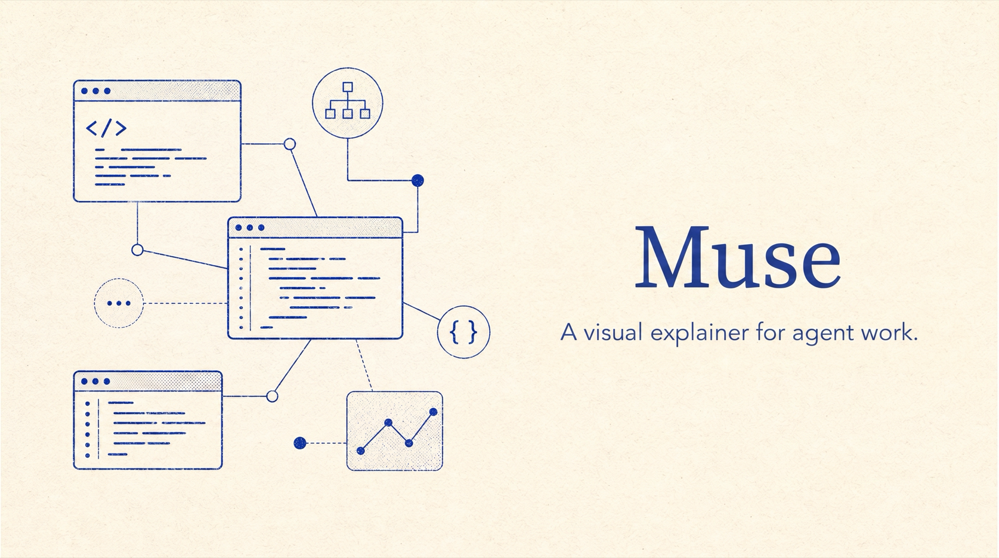
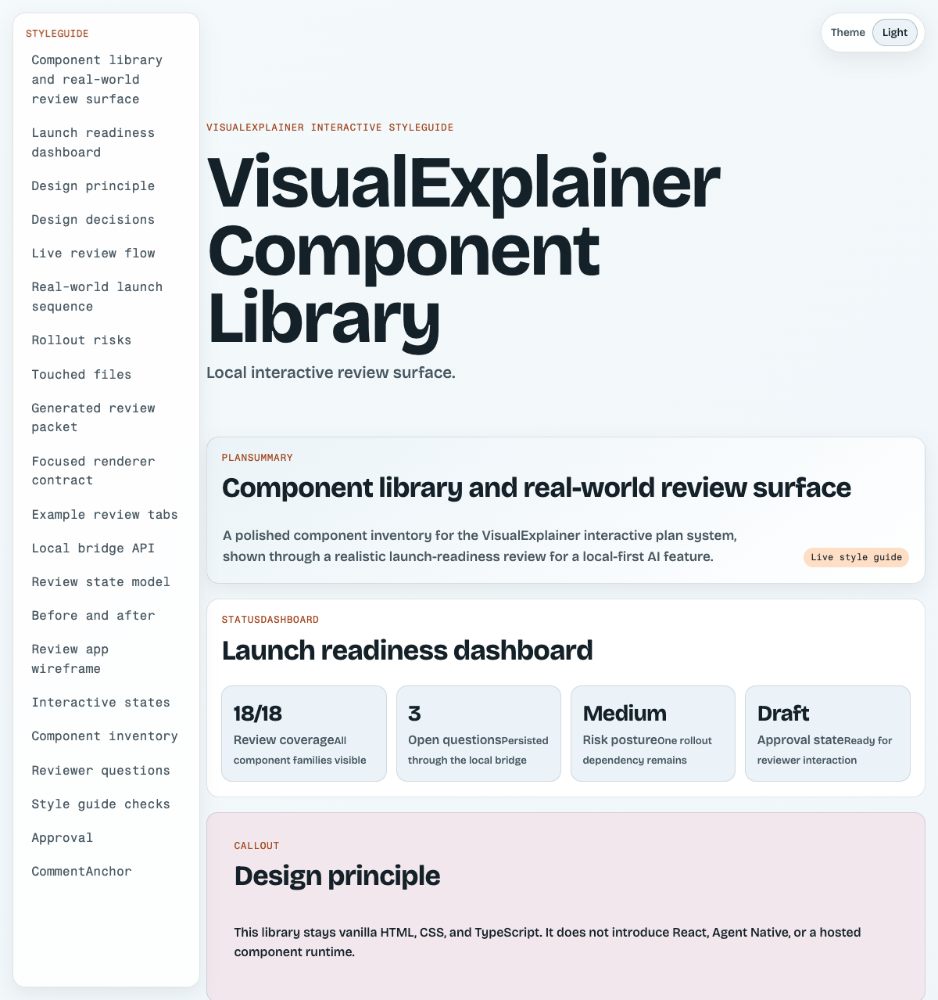

# muse

> [!NOTE]
> Big thanks to [nicobailon/visual-explainer](https://github.com/nicobailon/visual-explainer) for the original idea and work. [muse](https://github.com/edheltzel/Muse) has been **heavily modified** to fit my personal needs and will continue to change with more features.

**Turn dense agent output into beautiful browser-native pages people can actually understand.**

muse is an agent skill for diagrams, visual plans, diff reviews, project recaps, slide decks, and approval-aware MDX review pages. It is built for humans first: open the page, scan the structure, interact with the review controls, and hand an agent the resulting machine-readable context when you approve.



## What it makes

- **Architecture diagrams** with real Mermaid rendering, zoom, pan, and expand controls.
- **Visual implementation plans** with questions, checklists, comments, approval state, and `agent-handoff.*` files.
- **Visual recaps** for branches, commits, PRs, and diffs.
- **Diff and plan reviews** that are easier to scan than terminal walls of text.
- **Slide decks** when a walkthrough needs presentation pacing instead of a scrollable page.
- **Component-library demos** that show every supported MDX block in one place.

## See it locally

This repository includes a complete component-library fixture that acts like a style guide for the interactive plan system.

```bash
vp install
vp run component-explorer:render
vp run component-explorer:serve
```

Then open:

```text
http://localhost:7375/
```

The explorer includes every current MDX component, search and family filters, copyable MDX source, a realistic launch-readiness use case, light/dark themes, Mermaid rendering, review questions, checklist state, and an approval gate.

## Quick examples

```text
> draw a diagram of our authentication flow
> /diff-review
> /generate-visual-plan ~/docs/refactor-plan.md
> /generate-visual-recap main...HEAD
> /project-recap --slides
```

Static diagram commands write portable HTML pages. Interactive plan and recap commands write local MDX review folders with persisted state and approval handoff files.

## Why this exists

Agents are good at structure but bad at presentation by default. Ask for a diagram and you usually get ASCII boxes. Ask for a comparison and you get a pipe table that wraps in the terminal. Ask for a plan and you get prose that nobody wants to review line by line.

muse turns that same information into a web page:

1. the agent gathers the facts,
2. the skill picks the right visual treatment,
3. the result opens in a browser,
4. the human reviews visually,
5. interactive plans can produce an agent-readable handoff after approval.

## Install

This section gives you one working path for each supported agent surface. After installing, start a fresh agent session and use the same request everywhere:

```text
Use muse to <task>.
```

The unavoidable host-native explicit fallbacks and their reasons live in one place: [Invoking muse](plugins/Muse/skills/muse/references/invocation.md).

### Claude Code

Install from the Claude Code plugin marketplace:

```shell
/plugin marketplace add edheltzel/Muse
/plugin install muse@muse-marketplace
```

You should see Claude Code report that the `muse` plugin installed successfully.

Start a fresh Claude Code session after installation. Use the shared request above; see the canonical invocation reference for Claude's namespaced fallbacks.

### Pi

Install the package from GitHub:

```bash
pi install git:github.com/edheltzel/Muse
```

You should see Pi install the package and register the skill plus command templates. Start a fresh Pi session, then use the shared request above.

For local development, install from a checkout instead:

```bash
git clone --depth 1 https://github.com/edheltzel/Muse.git
pi install ./Muse
```

The package manifest advertises the canonical skill and command templates:

```json
"pi": {
  "skills": ["./plugins/Muse"],
  "prompts": ["./plugins/Muse/commands"]
}
```

### OMP

Install directly from GitHub with OMP:

```bash
omp install github:edheltzel/Muse
```

For project-scoped installs, use `--scope project` with a marketplace install (git installs are always user-scoped):

```bash
omp install --scope project muse@muse-marketplace
```

For local development, install from the repo root of a checkout (local installs need the root `package.json` manifest, so `omp install ./plugins/Muse` does not work):

```bash
git clone --depth 1 https://github.com/edheltzel/Muse.git
cd Muse
omp install .
```

You can also install through the bundled marketplace catalog (local marketplace sources need a `./` prefix or an absolute path):

```bash
omp plugin marketplace add edheltzel/Muse
omp install muse@muse-marketplace
```

Verify that OMP loaded the plugin surfaces (inside the OMP TUI you can also run `/extensions`):

```bash
omp plugin list
```

Then start a fresh OMP session and use the shared request above.

Generated HTML pages should land in `.agents/diagrams/`. Interactive visual plans and recaps create local MDX review folders with state, comments, approval controls, and agent handoff files.

`/share-page` requires an OMP-compatible `vercel-deploy` plugin or skill. Install publishing support separately when you need hosted pages.

### Codex and ChatGPT

muse ships a native Codex plugin manifest. Add the bundled marketplace from Codex CLI:

```bash
codex plugin marketplace add edheltzel/Muse
codex plugin add muse@muse-marketplace
codex plugin marketplace list
```

Codex installs the plugin into its local cache; the same marketplace is also available in the ChatGPT desktop app's plugin directory. Start a new Codex task and use the shared request above. Codex can also activate `muse` implicitly from the skill description.

For a direct Codex CLI user-skill install without the plugin marketplace:

```bash
git clone --depth 1 https://github.com/edheltzel/Muse.git /tmp/Muse
mkdir -p ~/.agents/skills
cp -R /tmp/Muse/plugins/Muse/skills/muse ~/.agents/skills/muse
rm -rf /tmp/Muse
```

Codex scans `~/.agents/skills` for user skills. The older `~/.codex/skills` and `~/.codex/prompts` copy paths are not used; explicit fallback syntax remains centralized in the invocation reference.

### Cursor and OpenClaw

- Cursor: use `configs/cursor/muse.mdc` as the project rule.
- OpenClaw: use `configs/openclaw/AGENTS.md` as lightweight project guidance.

## Commands

| Command                 | Human result                                                               |
| ----------------------- | -------------------------------------------------------------------------- |
| `/generate-web-diagram` | A styled HTML diagram for any topic                                        |
| `/generate-visual-plan` | An interactive MDX implementation plan with review state and handoff files |
| `/generate-visual-recap` | A visual recap for a branch, commit, PR, or diff                          |
| `/generate-slides`      | A magazine-quality slide deck                                              |
| `/diff-review`          | A visual code-review page with architecture context                        |
| `/plan-review`          | A plan-vs-codebase review with risks and gaps                              |
| `/project-recap`        | A visual mental-model snapshot for returning to a project                  |
| `/fact-check`           | A code-grounded accuracy review for a document                             |
| `/share-page`           | A Vercel production URL for an HTML explainer page                         |

You rarely need the slash commands. On native-skill surfaces (Claude Code, Pi, OMP, and Codex) the skill auto-invokes from natural language — ask for a "visual explainer", say "visualize this", "visualize a plan", "make it visual", or "explain this visually", and `muse` picks the right treatment on its own. The slash commands are explicit shortcuts on harnesses that support command templates.

The skill also activates proactively when an agent is about to dump a complex table in the terminal: 4+ rows or 3+ columns should become a browser page.

## Interactive plans

Interactive plans are local-first review packets:

```text
.agents/visual-plans/<slug>/
├── plan.mdx
├── canvas.mdx                 optional UI/product canvas
├── visual-explainer.json      manifest
├── plan-state.json            local reviewer state
├── comments.json              local comment threads
├── agent-handoff.json         generated after approval
├── agent-handoff.md           generated after approval
└── dist/
    ├── index.html             interactive review page
    └── static-export.html     portable read-only export
```

The browser page supports:

- persisted reviewer answers,
- checklist state,
- approval and needs-revision controls,
- Mermaid diagrams with zoom/pan/expand,
- light/dark theme toggle,
- static export for sharing without the local bridge.

The review bridge binds to loopback and exposes a trusted originless local API for CLI clients. Originless mutations are intentional, but they must use `Content-Type: application/json`. Browser mutations that send `Origin` must match the bridge's exact loopback origin; foreign origins and opaque `Origin: null` requests are rejected. This is not a strict same-origin policy because trusted originless local clients remain supported by design.

Review mutations and approval publication are atomic against concurrent live `muse` processes: an OS-backed file lock serializes writers, and one pointer replacement publishes a complete state/handoff generation. This is a live-process atomicity guarantee, not crash durability. `muse` does not `fsync` files or directories, so power loss or an OS crash may still lose the latest filesystem writes; the next operation revalidates the surviving generation before using it.

## Component library fixture

Use the checked-in component explorer when you want to inspect the whole component system, filter by purpose, and copy a working MDX example:

```bash
vp run component-explorer:render
vp run component-explorer:serve
```

It covers:

- overview components: `PlanSummary`, `StatusDashboard`,
- planning and diagram components: `DecisionMatrix`, `ArchitectureDiagram`, `ImplementationTimeline`, `RiskRegister`,
- evidence components: `FileMap`, `FileTree`, `AnnotatedCode`, `DiffTabs`, `Tabs`,
- contract components: `ApiSurface`, `DataModel`, `Table`,
- product components: `Wireframe`, `BeforeAfter`, `StateGallery`,
- review controls: `Callout`, `QuestionForm`, `Checklist`, `ApprovalGate`, `CommentAnchor`.

## Development stack

muse uses **Vite+ as the project toolchain** with **Bun as the underlying package manager**.

- `vp install` installs dependencies through Bun because `packageManager` is pinned to `bun@1.3.14`.
- `vp build` runs the Vite+ production build.
- `vp run test` runs the existing Bun test suite.
- `vp run visual-plan:build` builds the interactive plan shell.
- `vp run visual-plan:render <plan-dir>` renders a plan folder.
- `vp run visual-plan:serve <plan-dir> [port]` serves a local review page.

```bash
vp install
vp run test
vp run visual-plan:build
```

Use `vp add`, `vp remove`, and `vp install` for dependency management. Do not use `npm`, `npx`, `pnpm`, or `yarn` in this repo.

## Project layout

```text
.claude-plugin/                         marketplace metadata
plugins/Muse/
├── .claude-plugin/                     plugin manifest
├── commands/                           command prompts
└── skills/muse/
    ├── SKILL.md                        skill instructions
    ├── references/                     design, Mermaid, MDX, state docs
    ├── templates/                      HTML templates
    ├── tools/interactive-plan/         renderer, server, state, handoff code
    └── scripts/share.sh                Vercel share helper
configs/                                harness-specific guidance
tests/fixtures/interactive-plans/       reproducible review-page fixtures
docs/assets/                            README screenshots and visual examples
AGENTS.md                               agent-facing repository guide
```

## Agent reference

Agents should read [`AGENTS.md`](AGENTS.md) before editing this repository. The short version:

- use Vite+ commands (`vp install`, `vp run`, `vp build`),
- keep Bun as the underlying package manager,
- preserve vanilla HTML/CSS/TypeScript boundaries,
- do not add React or Agent Native,
- render visual behavior in browser before claiming it works,
- update the component-library fixture when adding or changing components.

## Limitations

- Generated HTML is portable, but auto-opening depends on the harness, browser access, and sandbox rules.
- Mermaid rendering in interactive pages uses the Mermaid browser runtime from jsDelivr; the page keeps a readable source fallback if the runtime is unavailable.
- `/share-page` uses Vercel CLI and requires a one-time `vercel login`.
- Visual quality depends on the model following the skill’s design rules; the component-library fixture exists so regressions are easier to see.

## Credits

Borrows ideas from [Anthropic's frontend-design skill](https://github.com/anthropics/skills) and [interface-design](https://github.com/Dammyjay93/interface-design).

## License

MIT
