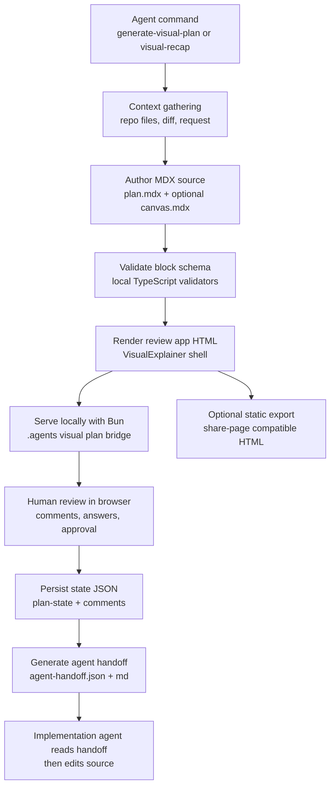
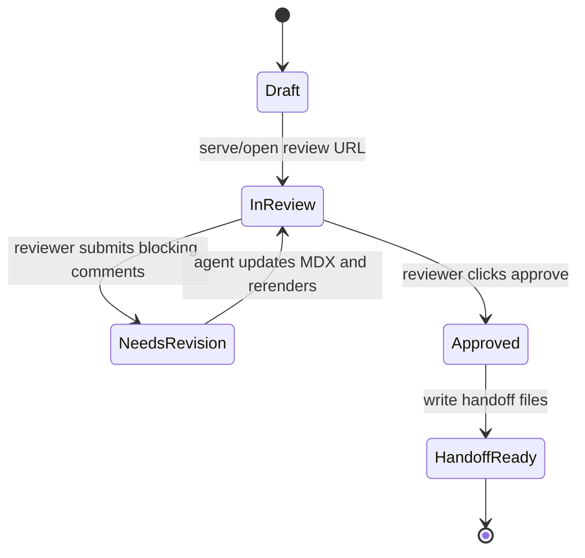

# feat: Add interactive MDX visual plans and recaps

## Goal Capsule

VisualExplainer should stop treating visual plans as one-off static HTML pages. It should generate repo-owned MDX plan and recap artifacts, render them into an interactive local review surface, collect approval/comments/answers, and write a machine-readable handoff that agents can consume before implementation.

This plan borrows the useful shape from BuilderIO's `/visual-plan` and `/visual-recap`: structured MDX, block-based diagrams, file maps, annotated code, open questions, UI wireframes when relevant, and approval-oriented review. It explicitly does **not** incorporate Agent Native, the hosted Plan MCP connector, the Agent Native app, `@agent-native/*` packages, or any hosted database workflow.

---

## Problem Frame

Current VisualExplainer output is beautiful but passive. `plugins/VisualExplainer/commands/generate-visual-plan.md` asks the agent to produce a self-contained HTML implementation plan in `.agents/diagrams/`, but the page has no durable source format, no review state, no approval contract, and no way for later agents to know what the human approved. `diff-review.md` and `project-recap.md` have the same pattern: gather facts, generate static HTML, open it in the browser.

BuilderIO's skills solve the medium problem: plans and recaps become structured, commentable review artifacts rather than walls of chat or raw diffs. The part to copy is the product pattern, not the platform dependency. VisualExplainer should keep its local, portable, self-contained ethos while adding MDX as source and a local approval bridge.

---

## Scope Boundaries

### In Scope

- Add a local MDX-based source format for visual plans and visual recaps.
- Add an interactive renderer that turns MDX folders into browser-reviewable HTML.
- Add a local Bun review bridge so approve/revise/comment/question events persist to disk.
- Update `/generate-visual-plan` to create an interactive visual plan instead of static-only HTML.
- Add a `/visual-recap` command for PR/branch/commit/diff recaps.
- Preserve the current static HTML/Vercel sharing path as an export target, not the source of truth.
- Add tests for schema validation, rendering, review-state persistence, and command contract fixtures.
- Use Vite with the Vite Plus setup for the browser review app and static export pipeline.
- Add first-class MDX components that make plans interactive and visually informative, not just Markdown with styling.

### Out of Scope

- No Agent Native integration.
- No hosted Plan MCP connector.
- No `@agent-native/*` dependency.
- No React, React DOM, React app build tooling, or React-dependent MDX runtime.
- No hosted database, account, auth, or share-by-default workflow.
- No replacement of existing static diagram commands such as `/generate-web-diagram` or `/generate-slides`.
- No full collaborative multi-user editor in this iteration; the local bridge is single-machine review state.

### Deferred to Follow-Up Work

- GitHub Action that auto-generates a visual recap for every PR.
- Multi-reviewer merge semantics for concurrent comments.
- Cloud/share-hosted version of the local review bridge.
- Full visual editing of MDX blocks in the browser; v1 can collect feedback and approval while source edits remain agent/file based.

---

## Requirements

- **R1. Local-first source of truth.** Every interactive plan/recap has a folder under `.agents/visual-plans/<slug>/` or `.agents/visual-recaps/<slug>/` containing MDX source and state JSON.
- **R2. MDX authoring.** Plans and recaps are authored as MDX with a constrained component/block catalog, not as freeform static HTML.
- **R3. Interactive review.** Rendered output supports section navigation, collapsible details, tabs, question forms, checklists, comments, and an approve/revise/needs-work gate.
- **R4. Agent-readable approval.** Approval writes `agent-handoff.json` and `agent-handoff.md` with status, approved scope, question answers, unresolved comments, and implementation instructions.
- **R5. Static export remains available.** The renderer can export a self-contained `.html` page for archiving or `/share-page`, but static export is secondary to MDX + state.
- **R6. Recaps summarize existing diffs.** A new recap command maps diffs to file trees, annotated diffs, API/schema summaries, diagrams, UI impact, and review notes.
- **R7. No Agent Native dependency.** Package manifests, scripts, prompts, and docs must not require or mention `@agent-native/*` as an implementation dependency.
- **R8. Backward compatibility.** Existing commands keep working; static diagram users are not forced into the interactive plan flow.
- **R9. Vite Plus with a lightweight MDX runtime.** The browser review app and static export pipeline use Vite/Vite Plus with the smallest Vite-compatible MDX runtime that satisfies rendering; package manifests must not add React, React DOM, or React-dependent renderer tooling.
- **R10. Runtime size guard.** The chosen MDX/browser runtime must have an explicit bundle-size/dependency budget so the plan cannot quietly grow into a heavyweight app shell.
- **R11. MDX component library.** Plans and recaps expose documented MDX components for visual structure, implementation evidence, review decisions, and approval state; authors should not hand-roll equivalent HTML for common plan elements.

---

## Key Technical Decisions

### KTD1. Build a local MDX plan runtime, not a hosted integration

Use repo-owned MDX folders plus a Bun renderer/server. This satisfies the user constraint to avoid Agent Native while keeping the useful review model: structured blocks, local source, browser review, and persisted feedback.

Rejected alternative: use BuilderIO's Agent Native local-files mode. It is close conceptually, but it still brings Agent Native commands, schemas, and app assumptions into this repo. The user explicitly asked not to incorporate Agent Native.

### KTD2. Make MDX the canonical source and HTML an artifact

The current command model treats HTML as the only deliverable. The new model should write `plan.mdx`, optional `canvas.mdx`, and `.plan-state.json`, then render HTML from those files. Agents can patch MDX; browsers consume rendered HTML; approval state lives in JSON.

### KTD3. Use Vite Plus with a lightweight non-React MDX runtime

MDX needs a JavaScript/runtime layer somewhere: either compile-time evaluation, a JSX-compatible runtime, or a browser-side component registry. The browser review app should use Vite, specifically the Vite Plus setup Ed requested, and choose the smallest Vite-compatible runtime that works. Acceptable directions are a custom JSX/runtime shim, a small MDX-to-block-tree transform, or a lightweight Vite-supported runtime if measurement proves it stays small. Do not add React, React DOM, React app build tooling, or an MDX renderer path that depends on React semantics.

### KTD4. Use a local review bridge for persistence

A static HTML file cannot write approval state back to the repo without browser download hacks. A small Bun server can serve pages built by the Vite Plus pipeline and receive `POST` requests that write `plan-state.json`, `comments.json`, and handoff files. Static export remains a fallback with "copy/download approval packet" messaging, but the normal command should start the local bridge.

### KTD5. Keep the block catalog small and VisualExplainer-native

Start with blocks that map directly to existing VisualExplainer strengths and BuilderIO's useful prior-art categories: `Plan`, `Recap`, `Section`, `Callout`, `Diagram`, `FileTree`, `AnnotatedCode`, `Diff`, `Tabs`, `QuestionForm`, `Checklist`, `Wireframe`, `ApprovalGate`. Avoid a large generic component framework in v1.

### KTD6. Treat MDX components as the plan authoring API

The plan source should read like a structured document with explicit VisualExplainer components, not like arbitrary HTML embedded in Markdown. Components such as `PlanSummary`, `DecisionMatrix`, `ArchitectureDiagram`, `FileMap`, `AnnotatedCode`, `DiffTabs`, `QuestionForm`, `RiskRegister`, `ImplementationTimeline`, `Wireframe`, and `ApprovalGate` should compile into validated block data plus renderer-owned visuals/interactions. This keeps plans visually rich while preserving schema validation, accessibility, static export, and agent-readable state.

### KTD7. Command prompts become orchestration contracts

The skill remains prompt-driven, but commands should now instruct the agent to produce structured MDX with VisualExplainer components, run local validation/rendering, open the local review URL, and tell future agents to read `agent-handoff.json` after approval. The command files are part of the product, not just docs.


---

## High-Level Technical Design



### Artifact shape

```text
.agents/visual-plans/<slug>/
├── plan.mdx                 # canonical plan document
├── canvas.mdx               # optional UI/storyboard surface
├── prototype.mdx            # optional future functional prototype source
├── visual-explainer.json    # metadata, kind, source refs, timestamps
├── plan-state.json          # review status, answers, checklist state
├── comments.json            # anchored comments and resolution state
├── agent-handoff.json       # generated after approval
├── agent-handoff.md         # human-readable implementation handoff
└── dist/
    ├── index.html           # rendered interactive review page
    └── static-export.html   # optional standalone export
```

### Review-state lifecycle



---

## Output Structure

```text
plugins/VisualExplainer/
├── commands/
│   ├── generate-visual-plan.md      # rewrite for MDX + interactive approval
│   ├── visual-recap.md              # new diff/PR/branch recap command
│   ├── diff-review.md               # keep static review, optionally point to recap for interactive mode
│   └── share-page.md                # document static export compatibility
└── skills/visual-explainer/
    ├── SKILL.md                     # update workflow and command catalog
    ├── references/
    │   ├── interactive-plans.md     # new local-first review model
    │   ├── mdx-blocks.md            # block catalog and authoring rules
    │   ├── review-state.md          # approval/comment/handoff schema
    │   └── recap-quality.md         # visual recap content rules
    ├── templates/
    │   ├── interactive-plan-shell.html
    │   └── interactive-recap-shell.html
    └── tools/
        └── interactive-plan/
            ├── schema.ts
            ├── mdx-loader.ts
            ├── render.ts
            ├── server.ts
            ├── state-store.ts
            └── handoff.ts

tests/
├── interactive-plan-schema.test.ts
├── interactive-plan-render.test.ts
├── interactive-plan-state-store.test.ts
├── interactive-plan-command-contract.test.ts
└── fixtures/interactive-plans/
    ├── minimal-plan/
    ├── ui-plan-with-canvas/
    └── recap-with-diff/
```

---

## Implementation Units

### U1. Define VisualExplainer-native MDX and state contracts

**Goal:** Establish the local artifact contract before renderer work begins.

**Requirements:** R1, R2, R4, R7.

**Dependencies:** None.

**Files:**

- Create `plugins/VisualExplainer/skills/visual-explainer/references/interactive-plans.md`
- Create `plugins/VisualExplainer/skills/visual-explainer/references/mdx-blocks.md`
- Create `plugins/VisualExplainer/skills/visual-explainer/references/review-state.md`
- Create `plugins/VisualExplainer/skills/visual-explainer/tools/interactive-plan/schema.ts`
- Create `tests/interactive-plan-schema.test.ts`
- Create `tests/fixtures/interactive-plans/minimal-plan/plan.mdx`

**Approach:**

Define a small block vocabulary with TypeScript interfaces and runtime validators. Include stable IDs on every interactive block so review state can anchor to `blockId`, not brittle text positions. Define artifact metadata separately from mutable review state.

Minimum schemas:

- `VisualPlanManifest`: `kind`, `slug`, `title`, `createdAt`, `source`, `entry`, `dist`.
- `ReviewState`: `status`, `approvedAt`, `reviewer`, `answers`, `checklist`, `unresolvedCommentIds`.
- `CommentThread`: `id`, `blockId`, `anchor`, `body`, `status`, `createdAt`, `resolvedAt`.
- `AgentHandoff`: `status`, `approvedScope`, `decisions`, `answers`, `implementationEntry`, `verification`, `openRisks`.

**Patterns to follow:**

- Existing skill references keep generation rules in markdown under `plugins/VisualExplainer/skills/visual-explainer/references/`.
- Existing command files are markdown contracts under `plugins/VisualExplainer/commands/`.
- BuilderIO prior art uses MDX as portable source, but this repo should own its schema.

**Test scenarios:**

- Valid minimal `plan.mdx` + manifest passes schema validation.
- Missing block IDs fails with a useful error naming the block type.
- Invalid `ReviewState.status` fails validation.
- `AgentHandoff` cannot be generated unless status is `approved`.
- Schema code contains no dependency on `@agent-native/*`.

**Verification:** Schema tests pass and the references explain the local-first, non-Agent-Native contract clearly enough for a future agent to author a valid fixture.

### U2. Add MDX loading and block rendering

**Goal:** Convert MDX source folders into an internal block tree and rendered HTML fragments.

**Requirements:** R1, R2, R3, R5, R7.

**Dependencies:** U1.

**Files:**

- Modify `package.json`
- Create `plugins/VisualExplainer/skills/visual-explainer/tools/interactive-plan/mdx-loader.ts`
- Create `plugins/VisualExplainer/skills/visual-explainer/tools/interactive-plan/render.ts`
- Create `plugins/VisualExplainer/skills/visual-explainer/tools/interactive-plan/client.ts`
- Create `plugins/VisualExplainer/skills/visual-explainer/templates/interactive-plan-shell.html`
- Create `vite.config.ts`
- Create `tests/interactive-plan-render.test.ts`
- Add fixture files under `tests/fixtures/interactive-plans/minimal-plan/`

**Approach:**

Add Bun scripts and a Vite Plus client pipeline. The renderer should parse the constrained MDX source into VisualExplainer-native blocks, validate those blocks, then render them through the smallest Vite-compatible runtime that satisfies the block catalog. The renderer should not execute arbitrary remote scripts from MDX. Components become VisualExplainer block renderers and browser behaviors, not React components.

Recommended package posture:

- Use Bun scripts for validation, rendering, server startup, and tests.
- Use Vite Plus for client bundling, dev serving, and static review-app assets.
- Treat the MDX runtime as an explicit design choice: first try compile-time MDX-to-block-tree or a custom JSX/runtime shim; allow a tiny Vite-supported runtime only if it is measured and documented.
- Do not add React, React DOM, React app scaffolding, or React-dependent MDX renderers.
- Add `bun test` using Bun's built-in test runner.

The shell should reuse existing VisualExplainer conventions: distinctive typography, CSS custom properties, responsive section nav, Mermaid zoom controls, accessible tables, and static export compatibility.

**Patterns to follow:**

- `plugins/VisualExplainer/skills/visual-explainer/templates/mermaid-flowchart.html` for zoomable Mermaid shell behavior.
- `plugins/VisualExplainer/skills/visual-explainer/references/css-patterns.md` for depth, callouts, code blocks, overflow protection.
- `plugins/VisualExplainer/skills/visual-explainer/templates/data-table.html` for tables.

**Test scenarios:**

- Minimal MDX renders a page with title, section nav, and approval gate.
- `Diagram` block renders with the VisualExplainer Mermaid zoom-control wrapper, not bare `<pre class="mermaid">`.
- `QuestionForm` block renders persisted input names keyed by question ID.
- Static export does not include localhost-only API URLs as hard dependencies.
- Renderer rejects unknown MDX components with a clear validation error.
- Renderer/client build contains no React or React DOM dependency.
- Production client bundle/dependency report stays under the runtime budget chosen in U2.

**Verification:** `bun test tests/interactive-plan-render.test.ts` passes, the Vite Plus build renders the fixture, the runtime size/dependency report is within budget, and fixture output includes no Agent Native or React branding/package references.

### U3. Implement the local review bridge and state store

**Goal:** Make the rendered plan interactive and persist human review events to disk.

**Requirements:** R3, R4, R5.

**Dependencies:** U1, U2.

**Files:**

- Create `plugins/VisualExplainer/skills/visual-explainer/tools/interactive-plan/server.ts`
- Create `plugins/VisualExplainer/skills/visual-explainer/tools/interactive-plan/state-store.ts`
- Create `plugins/VisualExplainer/skills/visual-explainer/tools/interactive-plan/handoff.ts`
- Create `tests/interactive-plan-state-store.test.ts`
- Modify `package.json`

**Approach:**

Add a Bun local server that serves one plan folder and exposes JSON endpoints:

- `GET /` redirects to the current plan page.
- `GET /plan-state.json` returns review state.
- `POST /api/state` updates answers/checklists/status.
- `POST /api/comments` appends or resolves comments.
- `POST /api/approve` marks approved and generates handoff files.
- `GET /agent-handoff.json` returns the current handoff when approved.

The server writes atomically: write temp file, then rename. This avoids partial JSON if the process exits mid-write. The browser client should degrade gracefully when opened as `file://`: show the page and provide a "download/copy approval packet" fallback, but clearly state that agent-readable persistence requires the local bridge.

**Patterns to follow:**

- Existing output location convention uses `.agents/diagrams/`; use `.agents/visual-plans/` and `.agents/visual-recaps/` for source/state to keep generated artifacts grouped.
- Existing `share.sh` shows the repo already accepts small local scripts for generated output workflows.

**Test scenarios:**

- Server can start against a fixture folder and return `plan-state.json`.
- `POST /api/state` persists question answers and checklist state.
- `POST /api/comments` adds an anchored comment without overwriting existing comments.
- `POST /api/approve` writes both `agent-handoff.json` and `agent-handoff.md`.
- Invalid JSON request returns a 400 and does not mutate existing state.
- Concurrent writes do not produce malformed JSON.

**Verification:** State-store tests pass and a fixture can be approved through HTTP without manual file edits.

### U4. Build the interactive block library

**Goal:** Provide first-class MDX components that make plans and recaps interactive, visually informative, and schema-valid.

**Requirements:** R2, R3, R6, R8, R11.

**Dependencies:** U2.

**Files:**

- Extend `plugins/VisualExplainer/skills/visual-explainer/tools/interactive-plan/render.ts`
- Create `plugins/VisualExplainer/skills/visual-explainer/tools/interactive-plan/components.ts`
- Extend `plugins/VisualExplainer/skills/visual-explainer/references/mdx-blocks.md`
- Create `plugins/VisualExplainer/skills/visual-explainer/references/mdx-components.md`
- Create `plugins/VisualExplainer/skills/visual-explainer/references/recap-quality.md`
- Extend fixtures under `tests/fixtures/interactive-plans/`
- Extend `tests/interactive-plan-render.test.ts`

**Approach:**

Implement MDX components in priority order:

1. Review components: `ApprovalGate`, `QuestionForm`, `Checklist`, `CommentAnchor`, `Callout`.
2. Visual explanation components: `PlanSummary`, `StatusDashboard`, `DecisionMatrix`, `ArchitectureDiagram`, `ImplementationTimeline`, `RiskRegister`.
3. Implementation evidence components: `FileMap`, `FileTree`, `AnnotatedCode`, `DiffTabs`, `ApiSurface`, `DataModel`.
4. UI/product components: `Wireframe`, `BeforeAfter`, `StateGallery`.

Each component should compile into validated block data, renderer-owned HTML/CSS, and optional browser behavior. Authors should use these components in MDX instead of hand-rolling repeated HTML. Inline browser JavaScript can power tabs, checklists, forms, comments, diagram controls, and approval. Do not introduce a client-side framework unless the lightweight-runtime decision in U2 explicitly justifies it.

**Patterns to follow:**

- BuilderIO's `document-quality.md` maps plan content to block types; adapt the block taxonomy but use VisualExplainer-native rendering.
- BuilderIO's `wireframe.md` has useful wireframe quality rules: semantic HTML fragments, renderer-owned theme tokens, no full HTML documents inside wireframes, no hardcoded theme colors. Adapt those rules into `mdx-blocks.md` without importing Agent Native names.
- Existing VisualExplainer template rules own visual quality: component output should reuse the Mermaid zoom shell, responsive navigation, accessible tables, code block styling, depth tiers, and overflow protection instead of inventing one-off markup.

**Test scenarios:**

- `Tabs` preserves all tab panel content in static export and interactive mode.
- `AnnotatedCode` renders line numbers and annotations anchored to stable line ranges.
- `Diff` renders added/removed/context lines with accessible labels.
- `FileTree` renders add/modify/delete badges and nested directories from JSON data.
- `Wireframe` rejects `<html>`, `<head>`, `<body>`, and `<script>` tags.
- `QuestionForm` supports single, multi, and freeform questions with recommended defaults.
- `PlanSummary`, `DecisionMatrix`, `ArchitectureDiagram`, `FileMap`, `DiffTabs`, `QuestionForm`, and `ApprovalGate` can all be authored from MDX and survive validation.
- Common visual components render useful default chrome without authors embedding raw HTML.
- Interactive components persist state through stable component/block IDs.

**Verification:** Fixtures render through MDX components without clipped content, unknown blocks, inaccessible controls, broken interactions, or console errors in the generated shell.

### U5. Rewrite visual plan generation around MDX + approval

**Goal:** Make `/generate-visual-plan` produce an interactive MDX plan and local review URL.

**Requirements:** R1, R2, R3, R4, R5, R7, R8, R11.

**Dependencies:** U1, U2, U3, U4.

**Files:**

- Modify `plugins/VisualExplainer/commands/generate-visual-plan.md`
- Modify `plugins/VisualExplainer/skills/visual-explainer/SKILL.md`
- Modify `README.md`
- Modify `CHANGELOG.md`
- Create `tests/interactive-plan-command-contract.test.ts`
- Create `tests/fixtures/interactive-plans/ui-plan-with-canvas/plan.mdx`
- Create `tests/fixtures/interactive-plans/ui-plan-with-canvas/canvas.mdx`

**Approach:**

Update the command from "generate a comprehensive visual implementation plan as a self-contained HTML page" to "author an MDX plan folder, validate it, render it, serve it locally, and surface the review URL." Keep the same research discipline from the current command: parse the request, read relevant code, identify files, design states/APIs/integration/edge cases, then verify facts before generating.

The command should require these MDX components/sections:

- `PlanSummary` for goal, scope, audience, and approval state.
- `BeforeAfter` or `DecisionMatrix` for current vs. target behavior.
- `Callout tone=\"decision\"` plus `DecisionMatrix` for key decisions and rejected alternatives.
- `FileMap` / `FileTree` with real repo-relative paths.
- `ArchitectureDiagram` for state/data/architecture when useful.
- `ImplementationTimeline` for ordered implementation units.
- `RiskRegister` for risks, mitigations, and open assumptions.
- `QuestionForm` for unresolved choices.
- `ApprovalGate` that writes the handoff.

For UI/product plans, require optional `canvas.mdx` with wireframe artboards. For backend/architecture/data plans, skip top canvas and use inline `Diagram`, `DataModel`-style tables, and annotated code.

**Patterns to follow:**

- Current `generate-visual-plan.md` lines 8-49 for research and fact-sheet discipline.
- Current VisualExplainer skill lines 72-82 for reading template/reference material before generating.
- BuilderIO `/visual-plan` planning discipline: standalone plans, research first, approval gate, bottom open questions.

**Test scenarios:**

- Command contract mentions MDX source folder, validation, local serve, review URL, and handoff files.
- Command contract does not instruct the agent to publish to Agent Native or call a Plan MCP connector.
- UI-heavy fixture includes `canvas.mdx`; backend fixture does not.
- Plan fixtures use MDX components for visual/interactive sections rather than raw HTML equivalents.
- Static export path remains documented.

**Verification:** Command-contract tests pass and README command table accurately reflects interactive visual plans.

### U6. Add Visual Recap as the reverse workflow

**Goal:** Add an interactive recap command for PRs, branches, commits, and diffs.

**Requirements:** R1, R2, R3, R4, R5, R6, R7, R11.

**Dependencies:** U1, U2, U3, U4.

**Files:**

- Create `plugins/VisualExplainer/commands/visual-recap.md`
- Modify `plugins/VisualExplainer/commands/diff-review.md`
- Modify `plugins/VisualExplainer/skills/visual-explainer/SKILL.md`
- Modify `README.md`
- Modify `CHANGELOG.md`
- Create `tests/fixtures/interactive-plans/recap-with-diff/plan.mdx`
- Extend `tests/interactive-plan-command-contract.test.ts`

**Approach:**

Keep `/diff-review` as the existing static HTML code-review page for users who want one file. Add `/visual-recap` for the interactive review artifact. The recap command should gather the same source facts as `diff-review.md` but map them into structured MDX:

- `PlanSummary` / recap summary for the outcome narrative.
- `FileTree` with change flags.
- `DiffTabs` with key changed files using `Diff` or `AnnotatedCode` panels.
- `ApiSurface` and `DataModel` components for contract changes where relevant.
- `Wireframe`, `BeforeAfter`, or `StateGallery` components when rendered UI changes.
- `RiskRegister` or review-note components for Good/Bad/Ugly/Questions.
- `ApprovalGate` or acknowledgement gate for reviewer signoff.

If the diff is tiny, the command should say the static diff is faster and skip the recap unless the user insists.

**Patterns to follow:**

- Current `diff-review.md` lines 16-32 for data gathering and fact verification.
- BuilderIO `/visual-recap` shape: file tree, key changes tabs, annotated diffs, UI impact, substantial but lean recap.

**Test scenarios:**

- Command parses branch, commit, `HEAD`, PR number, and range scopes consistently with current `diff-review.md`.
- Command requires `FileTree` and key-change `DiffTabs` for non-trivial recaps.
- UI-impact recap fixture includes at least one `Wireframe`, `BeforeAfter`, or `StateGallery` component.
- Tiny diff path explains when not to generate a recap.
- Command contains no Agent Native connector instructions.
- Recap fixtures use MDX components for visual/interactive sections rather than raw HTML equivalents.

**Verification:** Contract tests pass and the command appears in the skill and README command lists.

### U7. Wire generated handoffs into agent workflows

**Goal:** Make approval usable by future agents, not just visible to humans.

**Requirements:** R3, R4, R8.

**Dependencies:** U3, U5, U6.

**Files:**

- Extend `plugins/VisualExplainer/skills/visual-explainer/tools/interactive-plan/handoff.ts`
- Extend `plugins/VisualExplainer/skills/visual-explainer/references/review-state.md`
- Modify `plugins/VisualExplainer/commands/generate-visual-plan.md`
- Modify `plugins/VisualExplainer/commands/visual-recap.md`
- Modify `README.md`
- Extend `tests/interactive-plan-state-store.test.ts`

**Approach:**

Generated handoff files should be the bridge between review and implementation. The browser writes review state; `handoff.ts` converts it into a compact instruction packet. Commands should tell the agent: once the human approves, read `agent-handoff.json` before editing code and treat it as the approved scope.

`agent-handoff.json` should include:

- `approved: true` and timestamp.
- Plan/recap slug and source folder.
- Approved implementation units or recap acknowledgement.
- Resolved question answers.
- Remaining non-blocking comments.
- Blocking comments, if any, should prevent approved status.
- Verification contract copied from the plan.

**Patterns to follow:**

- Current command docs already include verification checkpoints; handoff should make those checkpoints machine-readable.
- PAI's plan execution convention expects downstream agents to read a plan path; this handoff gives them a smaller approved-scope entry point.

**Test scenarios:**

- Handoff generation fails when unresolved blocking comments exist.
- Handoff includes question answers and checklist state.
- Handoff markdown is readable without the browser.
- Updating review state regenerates handoff deterministically.

**Verification:** State-store tests prove the approved handoff appears only after valid approval and contains the expected scope fields.

### U8. Add examples, documentation, and compatibility notes

**Goal:** Make the overhaul discoverable and safe for existing users.

**Requirements:** R5, R7, R8.

**Dependencies:** U5, U6, U7.

**Files:**

- Modify `README.md`
- Modify `CHANGELOG.md`
- Modify `plugins/VisualExplainer/skills/visual-explainer/SKILL.md`
- Modify `plugins/VisualExplainer/commands/share-page.md`
- Add example outputs under `tests/fixtures/interactive-plans/`

**Approach:**

Document two layers clearly:

1. Static VisualExplainer: diagrams, slides, static diff reviews, Vercel sharing.
2. Interactive VisualExplainer: MDX source folders, local bridge, review state, approval handoff, static export.

Call out that `/share-page` deploys static exports only; it does not deploy local review-state persistence. If a user wants to share an approved plan, they should export HTML plus commit or attach `agent-handoff.md/json` separately.

**Patterns to follow:**

- README's current install matrix and command table.
- Existing limitations section for honest constraints.

**Test scenarios:**

- README lists `/generate-visual-plan` and `/visual-recap` accurately.
- Documentation says `bun`, not npm/npx, for local scripts in this repo.
- Documentation states Agent Native is prior art only, not a dependency.
- Static share limitations are explicit.

**Verification:** Documentation review confirms no instructions imply hosted Agent Native usage or static HTML as the canonical plan source.

---

## Verification Contract

Implementation is complete when these checks pass:

1. `bun test` passes all new tests.
2. Rendering the minimal fixture writes `.agents/visual-plans/minimal-plan/dist/index.html` and validates the block schema.
3. Serving a fixture plan opens a local URL and returns `plan-state.json` over HTTP.
4. Submitting approval through the local API writes `agent-handoff.json` and `agent-handoff.md`.
5. Static export works without the local server and preserves readable content.
6. `/generate-visual-plan` command text instructs MDX + local bridge + approval handoff generation.
7. `/visual-recap` command text maps diff scopes to structured recap blocks.
8. No source file references `@agent-native/*` as an implementation dependency.
9. Existing `/generate-web-diagram`, `/generate-slides`, `/project-recap`, `/plan-review`, and `/share-page` command behavior remains documented.
10. MDX fixtures prove common plan/recap components render interactive controls and visual structure without authors hand-writing raw HTML replacements.

---

## Risk Analysis & Mitigation

- **Risk: MDX execution becomes an unsafe script surface.** Mitigation: constrained component map, validation before render, reject `<script>` in wireframes/custom fragments, and avoid arbitrary remote imports.
- **Risk: Browser approval state is lost.** Mitigation: local bridge writes JSON immediately; static mode shows degraded "copy/download" state with explicit warning.
- **Risk: The local server feels too heavy for a skill.** Mitigation: keep static export available and isolate the bridge to interactive plan/recap commands only.
- **Risk: The block catalog grows into a second app framework.** Mitigation: start with the minimum block set and require tests/fixtures for every new block.
- **Risk: Existing static users are surprised.** Mitigation: keep static commands intact, make only `/generate-visual-plan` interactive by default, add `/visual-recap` rather than replacing `/diff-review`.
- **Risk: Similarity to BuilderIO crosses from concept borrowing into dependency cloning.** Mitigation: document BuilderIO as prior art, use VisualExplainer-native names/schema, avoid Agent Native packages/tools/URLs, and keep renderer local.
- **Risk: MDX components become decorative wrappers instead of useful review tools.** Mitigation: every component needs a fixture, interaction/visual purpose, accessibility check, and at least one command-contract test proving when agents should use it.

---

## Sources & Research

- Local current behavior: `README.md` describes VisualExplainer as self-contained HTML output to `.agents/diagrams/` and lists current commands.
- Local current visual plan prompt: `plugins/VisualExplainer/commands/generate-visual-plan.md` gathers code context and emits static HTML.
- Local current diff review prompt: `plugins/VisualExplainer/commands/diff-review.md` gathers diffs and emits static HTML.
- Local current recap prompt: `plugins/VisualExplainer/commands/project-recap.md` produces static project state HTML, not diff-oriented visual recaps.
- BuilderIO skills catalog: `https://github.com/BuilderIO/skills/tree/main/skills` lists `visual-plan` and `visual-recap` among the skills.
- BuilderIO `/visual-plan` README: `https://raw.githubusercontent.com/BuilderIO/skills/main/skills/visual-plan/README.md` describes MDX plans, diagrams, file maps, annotated code, open questions, comments, and approval before code.
- BuilderIO `/visual-recap` README: `https://raw.githubusercontent.com/BuilderIO/skills/main/skills/visual-recap/README.md` describes diff-to-recap mapping with annotated diffs, diagrams, API/schema summaries, and file maps.
- BuilderIO document-quality reference: `https://raw.githubusercontent.com/BuilderIO/skills/main/skills/visual-plan/references/document-quality.md` is useful prior art for block selection, standalone plan quality, and open questions.
- BuilderIO local-files reference: `https://raw.githubusercontent.com/BuilderIO/skills/main/skills/visual-plan/references/local-files.md` confirms the concept can be source-file-based, but this plan implements a VisualExplainer-native version rather than Agent Native local-files mode.

---

## Open Questions

1. **Do we want `/diff-review` to stay purely static forever, or should it eventually become an alias to `/visual-recap` with a `--static` escape hatch?** Recommended default: keep `/diff-review` static for backward compatibility and add `/visual-recap` for the new interactive workflow.
2. **Should interactive artifacts live under `.agents/visual-plans/` only, or should approved plans be optionally copyable to `plans/<slug>/` for source control?** Recommended default: generate under `.agents/visual-plans/` and add a later export/check-in command if users ask.
3. **Should v1 include `prototype.mdx` execution, or reserve the file shape for later?** Recommended default: reserve the shape, implement static canvas/wireframes first.

---

## Definition of Done

- Visual plan generation is MDX-first, interactive, reviewable, and approval-aware.
- Visual recap exists as a separate interactive command for diffs/PRs/branches/commits.
- Approved review state is persisted in local JSON and summarized for agents.
- Static HTML remains supported as export/share output.
- The implementation uses Bun/TypeScript and contains no Agent Native dependency.
- The implementation uses Vite Plus for the browser review app with a measured lightweight MDX runtime and without React or React-dependent tooling.
- The implementation includes documented MDX components for summaries, decisions, diagrams, file maps, annotated code/diffs, questions, risks, timelines, wireframes, and approval.

