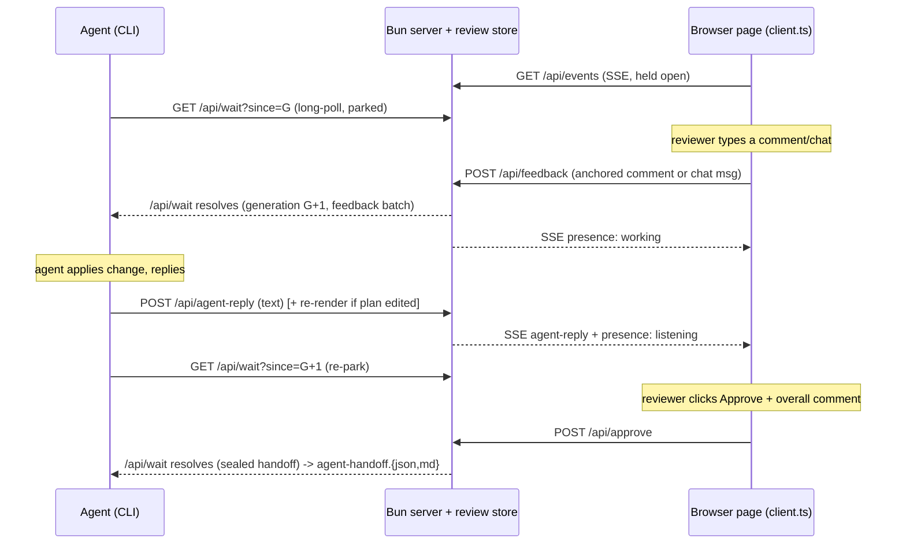

# Muse Collaboration Surface - Plan

**Target repo:** this repository (Muse). All paths below are repo-relative to the Muse root.

**Product Contract preservation:** Product Contract unchanged from the requirements-only source. This run adds the Planning Contract (KTDs, Implementation Units, Verification, Definition of Done) only.

---

## Summary

Make Muse's interactive plan/visual pages a two-way human↔agent collaboration surface: a reviewer chats with the agent, anchors comments to specific text or elements as *instructions*, and approves — and the agent applies changes and replies, all in the browser. Built entirely on Muse's existing MDX component system and design tokens, vanilla TS, no React. Single release.

The work adds a live transport layer to Muse's currently request/response server, a review-layer feedback model that stays out of the approval digest, native collaboration UI, quality guardrails, and a reduced-fidelity Mermaid sketch surface.

---

## Problem Frame

Muse today renders a plan to a browser page whose only interactivity is review controls (answers, checklist, block comments, approve), and communicates results back to the agent **only** through files the agent re-reads after the fact. There is no live channel, no anchored free-form feedback to the agent, and no chat. A prior branch (`feat/chat-panel`) built a version of this but was scrapped for ignoring Muse's design architecture and component library; it is reference-only. This plan rebuilds the capability on `master`, native to Muse's design system.

---

## Goal Capsule

- **Objective:** turn Muse plan/visual pages into an interactive human↔agent collaboration surface; the human never edits the document, the agent applies all changes.
- **Product authority:** Ed (owner).
- **Readiness:** implementation-ready.
- **Dominant risk:** the vanilla whiteboard (U12).

---

## Product Contract

> Preserved verbatim from the requirements source. See the "Requirements — in scope" and "Out of scope" sections below.

### Hard Constraint (governs every unit)

Every surface must be built natively on Muse's existing design architecture and reuse the MDX component system + design tokens (`render.ts` style block, `components.ts`, `shared.ts`). Vanilla TypeScript/HTML/CSS — no React, no Agent Native. A feature that works but is off-architecture is a failed feature.

### Requirements — in scope (single release)

**Collaboration loop (live + sealed handoff)**
- **CR-1** Live chat with the agent during review; agent replies appear in the browser.
- **CR-2** Agent-presence indicator (listening / working / waiting); sends blocked while the agent works.
- **CR-3** Approve / "I'm done" carrying an optional overall comment; seals the session and batches remaining feedback.
- **CR-4** Live loop and sealed handoff coexist in one session.

**Anchored feedback**
- **AF-1** Anchor a comment to a precise text range or a page element.
- **AF-2** Comments are instructions to the agent, not document edits; the agent applies changes.
- **AF-3** Feedback lives in Muse's review layer and travels to the agent; never written into the `.mdx`.
- **AF-4** Annotate ⇄ explore mode toggle.

**Escape hatch**
- **EH-1** "Copy everything as a prompt" — compose accumulated feedback into one prompt for when no agent is connected.

**Guardrails and polish**
- **GP-1** Open-time layout-audit gate.
- **GP-2** Design-match nudge (agent inspects the *visualized* project's design system).
- **GP-3** Portable export/share.
- **GP-4** Session identity keyed by canonical file path.

**Whiteboard**
- **WB-1** Rendered Mermaid becomes sketch-editable; reviewer draws, agent updates the Mermaid source. Vanilla, no React.

### Out of scope (non-goals)

- In-browser editing of the plan document (Roughdraft R3).
- Annotations stored as CriticMarkup inside the `.mdx` (Roughdraft R5-as-storage).
- Chat confined to a pre-approval / digest-sealed window (the scrapped model).

### Deferred to Follow-Up Work

- Full-fidelity vanilla diagram editing (an Excalidraw-class editor) — a research spike beyond this release; U12 delivers the reduced-fidelity sketch surface instead.

### Success criteria

- Every added surface reuses Muse's existing components and design tokens (the Hard Constraint).
- A reviewer can chat/comment and get changes applied without leaving the browser.
- The sealed handoff still emits `agent-handoff.{json,md}`.

---

## Key Technical Decisions

- **KTD-1 — Transport: long-poll (agent) + SSE (browser).** The agent parks on a long-poll `GET /api/wait?since=<generation>` (reusing the review store's existing per-write generation id); the browser holds one SSE stream for agent replies, presence, and review updates. *Rationale:* mirrors Lavish's proven split and fits Muse's single-process Bun server and loopback/origin model. *Alternative rejected:* WebSocket — heavier, bidirectional machinery Muse doesn't need when the agent side is a blocking CLI wait.
- **KTD-2 — Whiteboard is reduced-fidelity.** U12 overlays a vanilla draw/annotate layer on the rendered Mermaid SVG and captures strokes + typed intent as feedback; the agent edits the Mermaid **source**. *Rationale:* Lavish's whiteboard is React + Excalidraw, which the no-React constraint forbids, and there is no drop-in vanilla equivalent. Full editing is deferred (see Scope Boundaries).
- **KTD-3 — Chat/feedback stays out of the approval digest.** The transcript and anchored feedback are a separate review-layer artifact; `computeApprovalDigest` continues to bind only plan-source bytes + review state + resolved comments. *Rationale:* chat is ongoing, not approval-gated; when the agent edits the plan from chat, the source bytes change and approval self-invalidates through the existing digest mechanism — no need to seal the transcript.
- **KTD-4 — Anchoring is block-id + quote + offset with drift status.** A comment anchors to `{ blockId, quote, startOffset }`; on re-render it re-resolves to `exact` / `moved` / `orphaned` and is downgraded (never deleted) when its text drifts. *Rationale:* survives Muse's full-page re-render model; matches the pattern the scrapped branch prototyped (reference only).
- **KTD-5 — All UI extends Muse's existing surfaces.** New components go through `shared.ts` + `components.ts` + the single inline `client.ts` module; all styling uses the `render.ts` design tokens. No new rendering stack. *Rationale:* enforces the Hard Constraint structurally.

---

## High-Level Technical Design

Live-loop transport across the three participants (agent CLI, Bun server + review store, browser page):

---

## Implementation Units

Units are dependency-ordered and grouped in phases. U-IDs are stable.

### Phase A — Transport & session foundation

### U1. Live-loop transport and presence

- **Goal:** add the live channel Muse lacks — agent long-poll wait + browser SSE + presence — without breaking the existing request/response routes.
- **Requirements:** CR-1, CR-2, CR-4, GP-4.
- **Dependencies:** none.
- **Files:** `plugins/Muse/skills/muse/tools/interactive-plan/server.ts`, `plugins/Muse/skills/muse/tools/interactive-plan/state-store.ts` (generation/notify hooks), `tests/interactive-plan.test.ts`.
- **Approach:** add `GET /api/wait?since=<generation>` that parks the response until the review store's bundle generation advances past `since`, then returns the new generation + a feedback batch; wake all parked waiters on any store mutation; cap concurrent waiters (e.g. 64 → 503 above). Add `GET /api/events` SSE stream keyed to the session, emitting `presence`, `agent-reply`, and `review-update` events. Track presence (`listening` while a wait is parked, `working` after feedback is delivered until the next park, `waiting` when neither). Session key = canonical resolved file path of the plan dir (GP-4). Preserve the existing loopback/origin mutation guard (`requireMutationRequest`).
- **Patterns to follow:** existing route dispatch and `ReviewOperationError`→status mapping in `server.ts`; the store's existing per-write generation id used by `x-muse-review-generation`.
- **Test scenarios:** `Covers CR-1.` A parked `/api/wait?since=G` resolves with `G+1` when a mutation lands. Two waiters both wake on one mutation. The 65th concurrent waiter gets 503. SSE stream emits `presence: working` after a feedback POST and `presence: listening` when the agent re-parks. `/api/wait` with a stale `since` far behind current returns immediately. Server shutdown releases parked waiters (204/close), not a hang.
- **Verification:** an agent process blocked on `/api/wait` returns within the poll when the browser posts feedback; the browser SSE shows presence transitions.

### U2. Review-layer feedback model

- **Goal:** model chat messages and anchored feedback as review-layer state that travels to the agent and is excluded from the approval digest.
- **Requirements:** AF-2, AF-3, CR-1, KTD-3.
- **Dependencies:** U1.
- **Files:** `plugins/Muse/skills/muse/tools/interactive-plan/schema.ts`, `plugins/Muse/skills/muse/tools/interactive-plan/state-store.ts`, `plugins/Muse/skills/muse/tools/interactive-plan/handoff.ts`, `tests/interactive-plan.test.ts`.
- **Approach:** add `ChatMessage { id, role: "user"|"agent", body, at }` and extend feedback to carry an optional `anchor` (see U3). Persist a `transcript.json` + feedback entries in the atomic bundle alongside `plan-state.json`/`comments.json`. Extend `computeApprovalDigest` **explicitly to exclude** the transcript and unresolved agent-directed feedback so ongoing chat never invalidates approval; the digest keeps binding plan-source bytes, review state, and resolved comments. Sealed handoff (U7) includes the outstanding feedback batch in `agent-handoff`.
- **Patterns to follow:** the bundle/atomic-publish + symlink scheme and `validateReviewState*` validators in `state-store.ts`/`schema.ts`; `handoff.ts` canonical round-trip.
- **Test scenarios:** `Covers AF-3.` A chat message and an anchored comment persist and re-read across a new generation. Adding a chat message does NOT change `approvalDigest`. Editing plan-source bytes DOES change the digest (approval invalidates). A sealed handoff embeds outstanding feedback. `Test expectation:` transcript never written into `plan.mdx`.
- **Verification:** feedback survives re-render; digest is stable across chat, unstable across source edits.

### U3. Text/element anchoring engine

- **Goal:** anchor a comment to a text range or element and re-resolve it across re-renders with a drift status.
- **Requirements:** AF-1, KTD-4.
- **Dependencies:** U2.
- **Files:** `plugins/Muse/skills/muse/tools/interactive-plan/client.ts` (selection capture), `plugins/Muse/skills/muse/tools/interactive-plan/schema.ts` (anchor type), `plugins/Muse/skills/muse/tools/interactive-plan/state-store.ts` (re-resolve), `tests/interactive-plan.test.ts`.
- **Approach:** capture browser selection into `{ blockId, quote, startOffset }` (block id from the existing `data-block-id` attributes). On load/re-render, re-resolve each anchor against current block text → `exact` (quote found at offset), `moved` (found elsewhere), or `orphaned` (not found); downgrade rendering, never delete. Element anchors use the block id alone.
- **Patterns to follow:** the `data-block-id`/`data-block-type` attributes emitted by every renderer in `components.ts`; the scrapped branch's `{quote,start}` concept (reference only).
- **Test scenarios:** `Covers AF-1.` Selecting text yields the correct `{blockId, quote, startOffset}`. Re-resolve returns `exact` when unchanged, `moved` when the quote shifts within the block, `orphaned` when the quote is gone. An orphaned anchor's comment still renders (downgraded), not deleted.
- **Verification:** anchors survive a re-render with correct drift status.

### Phase B — Client collaboration UI (native components)

### U4. Chat drawer

- **Goal:** a native Muse-styled chat panel wired to the live loop.
- **Requirements:** CR-1, Hard Constraint.
- **Dependencies:** U1, U2.
- **Files:** `plugins/Muse/skills/muse/tools/interactive-plan/client.ts`, `plugins/Muse/skills/muse/tools/interactive-plan/render.ts` (drawer markup + tokens), `plugins/Muse/skills/muse/tools/interactive-plan/components.ts` (if a new review component is warranted), `plugins/Muse/skills/muse/references/mdx-components.md`, `tests/interactive-plan-browser.test.ts`.
- **Approach:** a collapsible chat drawer using existing design tokens and the inline `client.ts` module; incoming messages via the U1 SSE `agent-reply` event, outgoing via `POST /api/feedback` (chat role). No React; extend the single client script. Persist scroll/open state locally.
- **Patterns to follow:** `render.ts` `style` tokens and shell; `client.ts` existing DOM wiring for review controls; `AGENTS.md` design rules (restrained palette, no violet gradients).
- **Test scenarios:** `Covers CR-1.` Sending a message POSTs feedback and appends it to the drawer. An SSE `agent-reply` renders in the drawer. Drawer open/scroll state persists across reload. `Test expectation:` renders in both light and dark themes using existing tokens.
- **Verification:** a full browser round-trip (type → agent reply appears) works; drawer matches the component library visually.

### U5. Presence indicator and send-gating

- **Goal:** show agent presence and block sends while the agent is working.
- **Requirements:** CR-2.
- **Dependencies:** U1, U4.
- **Files:** `plugins/Muse/skills/muse/tools/interactive-plan/client.ts`, `plugins/Muse/skills/muse/tools/interactive-plan/render.ts`, `tests/interactive-plan-browser.test.ts`.
- **Approach:** subscribe to SSE `presence`; render listening/working/waiting state; disable the chat/comment send affordances while `working`; show a "no agent connected" state when `waiting`.
- **Patterns to follow:** U4 drawer; existing disabled-control styling in `render.ts`.
- **Test scenarios:** `Covers CR-2.` Send controls disable on `presence: working` and re-enable on `listening`. A `waiting` state shows the no-agent affordance. Presence indicator reflects each transition.
- **Verification:** presence UI tracks the U1 transitions live.

### U6. Anchored-comment UI + annotate/explore toggle

- **Goal:** let a reviewer select text/element and attach a comment-to-agent, with a mode toggle keeping the page usable.
- **Requirements:** AF-1, AF-2, AF-4.
- **Dependencies:** U3, U4.
- **Files:** `plugins/Muse/skills/muse/tools/interactive-plan/client.ts`, `plugins/Muse/skills/muse/tools/interactive-plan/render.ts`, `plugins/Muse/skills/muse/tools/interactive-plan/components.ts`, `tests/interactive-plan-browser.test.ts`.
- **Approach:** on selection (in annotate mode) show a floating "comment to agent" affordance; submit → anchored feedback (U3) delivered via the loop. Mode toggle (⌘/Ctrl+I) flips annotate ⇄ explore; explore mode suppresses annotation UI so links/controls work normally. Anchored comments render with drift styling.
- **Patterns to follow:** existing `CommentAnchor`/comment rendering; `client.ts` event wiring.
- **Test scenarios:** `Covers AF-1, AF-4.` Selecting text in annotate mode shows the affordance; submitting creates an anchored comment. Explore mode suppresses the affordance and lets a normal click through. ⌘/Ctrl+I toggles modes including from within a text field. A drifted comment renders downgraded.
- **Verification:** anchored comment reaches the agent as an instruction; mode toggle behaves.

### U7. Approve + overall comment + sealed handoff

- **Goal:** extend the approval control with an overall comment and seal the session, batching remaining feedback to the agent.
- **Requirements:** CR-3, CR-4.
- **Dependencies:** U2.
- **Files:** `plugins/Muse/skills/muse/tools/interactive-plan/components.ts` (ApprovalGate), `plugins/Muse/skills/muse/tools/interactive-plan/client.ts`, `plugins/Muse/skills/muse/tools/interactive-plan/state-store.ts` (approve path), `plugins/Muse/skills/muse/tools/interactive-plan/handoff.ts`, `tests/interactive-plan.test.ts`.
- **Approach:** add an optional overall-comment field to `ApprovalGate`; on approve, include it plus any outstanding feedback in the sealed handoff; still generate `agent-handoff.{json,md}` and resolve the parked `/api/wait`. Approval readiness rules unchanged.
- **Patterns to follow:** existing `approvePlan`, `assertApprovalReady`, and `ApprovalGate` renderer.
- **Test scenarios:** `Covers CR-3.` Approving with an overall comment embeds it in the handoff. Outstanding feedback is batched into the sealed handoff. `agent-handoff.{json,md}` still generate and round-trip. Approval still blocks on unresolved required items.
- **Verification:** sealed handoff carries overall comment + batch; existing approval invariants hold.

### U8. Copy-everything-as-a-prompt

- **Goal:** compose accumulated feedback + transcript into one prompt for when no agent is connected.
- **Requirements:** EH-1.
- **Dependencies:** U2.
- **Files:** `plugins/Muse/skills/muse/tools/interactive-plan/client.ts`, `plugins/Muse/skills/muse/tools/interactive-plan/render.ts`, `tests/interactive-plan-browser.test.ts`.
- **Approach:** a clipboard action that serializes open feedback, anchors (as quoted context), and the chat transcript into a readable prompt string; surfaced prominently when presence is `waiting` (no agent).
- **Patterns to follow:** existing copy affordances in `client.ts`.
- **Test scenarios:** `Covers EH-1.` Copy produces a prompt containing each open comment with its quoted anchor and the transcript. The action is surfaced when no agent is connected. Empty state produces a sensible minimal prompt.
- **Verification:** copied text is a usable agent prompt reflecting current feedback.

### Phase C — Guardrails & polish

### U9. Open-time layout-audit gate

- **Goal:** detect severe layout failures from rendered evidence before review and hold a curtain until clean.
- **Requirements:** GP-1.
- **Dependencies:** U1 (report path).
- **Files:** `plugins/Muse/skills/muse/tools/interactive-plan/client.ts`, `plugins/Muse/skills/muse/tools/interactive-plan/render.ts`, `tests/interactive-plan-browser.test.ts`.
- **Approach:** a vanilla client audit that, after fonts/animations settle and double-sampling, flags severe failures (clipped controls/text, viewport-unreachable content, near-total occlusion, material page overflow) from rendered geometry — excluding intentional ellipsis/clamp/visually-hidden. Hold a curtain overlay until clean with a bounded fail-open timeout and a "show anyway" override; report failures to the agent through the loop.
- **Patterns to follow:** Lavish's audit heuristics (reference only, `src/artifact-sdk.js`); Muse theming for the curtain.
- **Test scenarios:** `Covers GP-1.` A clipped required control is flagged; an intentional ellipsis is not. Curtain holds until clean, and the fail-open timeout lifts it. "Show anyway" overrides. A flagged failure reaches the agent.
- **Verification:** a deliberately-broken fixture raises a warning; a clean fixture does not.

### U10. Design-match nudge

- **Goal:** instruct the generating agent to match the *visualized* project's design system.
- **Requirements:** GP-2.
- **Dependencies:** none.
- **Files:** `plugins/Muse/skills/muse/SKILL.md`, `plugins/Muse/skills/muse/references/design.md` (or the existing design reference).
- **Approach:** a documentation/skill-prompt change instructing the agent to inspect the target project's Tailwind/theme/CSS/brand and match it (distinct from Muse's own component constraint). No runtime code. Keep the two design concepts explicitly separated in the doc.
- **Patterns to follow:** Lavish's `DESIGN_PRIORITY_RULE` prompt approach (reference only); existing Muse skill/reference tone.
- **Test scenarios:** `Test expectation: none — documentation/skill-prompt change, no behavioral code.` (Prose review only; verify the two design concepts are not conflated.)
- **Verification:** the skill guidance tells the agent to match the visualized project without contradicting the Muse-components constraint.

### U11. Portable export/share hardening

- **Goal:** ensure the static export strips the collaboration/review SDK and inlines assets so a shared page renders standalone.
- **Requirements:** GP-3.
- **Dependencies:** U4, U6 (so there is a collab layer to strip).
- **Files:** `plugins/Muse/skills/muse/tools/interactive-plan/render.ts` (static export path), `plugins/Muse/skills/muse/tools/interactive-plan/assets.ts`, `tests/interactive-plan.test.ts`.
- **Approach:** extend the existing `static-export.html` generation so the new chat/presence/annotation/audit client code is excluded in `staticMode`, leaving a clean read-only artifact with inlined fonts/assets.
- **Patterns to follow:** existing `RenderContext.staticMode` gating and `static-export.html` generation in `render.ts`.
- **Test scenarios:** `Covers GP-3.` The static export contains no chat/SSE/annotation client code. Fonts/assets are inlined. The exported page renders the plan read-only with no server.
- **Verification:** opening the export with no server shows the plan and none of the collab controls.

### Phase D — Whiteboard (highest risk)

### U12. Reduced-fidelity Mermaid sketch-over

- **Goal:** let a reviewer draw/annotate over a rendered Mermaid diagram and send it, with typed intent, as feedback the agent applies to the Mermaid source.
- **Requirements:** WB-1, KTD-2.
- **Dependencies:** U1, U2, U6.
- **Files:** `plugins/Muse/skills/muse/tools/interactive-plan/client.ts` (sketch overlay), `plugins/Muse/skills/muse/tools/interactive-plan/render.ts`, `tests/interactive-plan-browser.test.ts`.
- **Approach:** overlay a vanilla `<canvas>`/SVG draw layer aligned to a rendered `.mermaid` diagram; capture freehand strokes + a typed intent note; package as feedback (with the diagram index + a PNG/stroke snapshot) delivered via the loop. The agent edits the Mermaid **source**; the human never edits source directly. No React, no Excalidraw. `Execution note: prototype the overlay+capture on one diagram first and prove the round-trip before generalizing.`
- **Patterns to follow:** Muse's existing Mermaid render/zoom-pan handling in `client.ts` (align the overlay to the same canvas transform); Lavish's whiteboard *feedback packaging* concept (reference only).
- **Test scenarios:** `Covers WB-1.` Drawing over a diagram in annotate mode captures strokes bound to the correct diagram index. Submitting delivers a feedback item with intent + snapshot. The overlay aligns after zoom/pan. Explore mode disables the draw layer. `Test expectation:` no React/Excalidraw dependency added (dependency check).
- **Verification:** a sketch + note reaches the agent tied to the right diagram; the agent can act on it to edit the source.

---

## Verification Contract

- `vp run test` passes (extended `tests/interactive-plan.test.ts` and `tests/interactive-plan-browser.test.ts`).
- `vp run visual-plan:build` succeeds.
- Browser verification against a fixture (extend `tests/fixtures/interactive-plans/`): page opens; theme toggle works; a live round-trip (comment/chat → agent reply via SSE) completes; presence transitions; anchored comment with drift; approve-with-overall-comment emits `agent-handoff.{json,md}`; layout gate raises on a broken fixture; static export is collab-free; sketch-over round-trips on one diagram.
- No React / Agent Native dependency added (grep the dependency manifest and the diff).

## Definition of Done

- All in-scope requirements (CR-1..4, AF-1..4, EH-1, GP-1..4, WB-1) have a passing unit + test scenarios.
- Every new surface uses Muse's existing components/design tokens; nothing off-architecture (Hard Constraint) — verified in browser against the component library.
- Chat/feedback excluded from the approval digest; source edits still invalidate approval.
- Component-library fixture and `references/mdx-components.md` updated for any new component.

---

## Risks & Dependencies

- **R1 — Whiteboard (U12) is the dominant risk.** No drop-in vanilla Excalidraw; reduced-fidelity is the committed scope, full editing deferred. Mitigation: prototype the single-diagram round-trip first; keep U12 last so a slip doesn't block the rest.
- **R2 — Transport is new core infra (U1).** Parked long-polls + SSE must not wedge the single-process Bun server or leak waiters. Mitigation: waiter cap, shutdown release, tests for both.
- **R3 — Digest invariant (KTD-3).** Excluding the transcript from the digest must be exact, or approval semantics break. Mitigation: explicit digest tests (chat-stable, source-unstable).
- **R4 — Anchor drift across re-render (U3).** Muse re-renders the whole page; anchors must re-resolve, not vanish. Mitigation: drift-status tests.
- **R5 — Two "design" concepts (GP-2 vs Hard Constraint).** Must stay distinct in docs to avoid the agent applying the wrong one. Mitigation: explicit separation in U10.

## Open Questions (deferred to implementation)

- Exact SSE event payload shapes and reconnection/backoff behavior (resolve against Muse's server once U1 lands).
- Whether the sketch snapshot in U12 is a PNG, serialized strokes, or both — decide when prototyping the round-trip.
- Whether anchored-comment offsets need normalization for whitespace/markdownish rendering — resolve against `components.ts` output during U3.

## Sources & Research

- Research report: `scratchpad/muse-integration-research.md` (session scratchpad; source-level analysis of Muse, Roughdraft, Lavish).
- Muse interactive-plan core: `plugins/Muse/skills/muse/tools/interactive-plan/{schema,state-store,server,client,render,components,shared,handoff,assets}.ts`.
- Reference-only (scrapped): `feat/chat-panel` git history (recoverable via reflog).
- External references (reference-only): Roughdraft `packages/server/src/review-events.ts`, `packages/app/src/DocumentWorkspace.tsx`; Lavish `src/server.js`, `src/artifact-sdk.js`, `src/design-reference.js`, `src/whiteboard-frame.js`.
